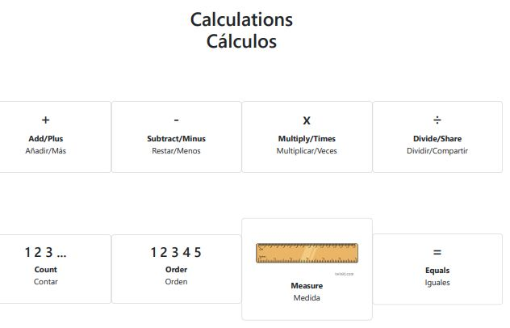

# translation-mats
In 2022 I recieved several students from Ukraine, with varying levels of skill in English. For students with poor English, translation mats can be a vital educational tool that allows students to learn key vocabulary and links their prior knowledge to their future education. Unfortunately, Ukrainian translation mats did not exist (this is also true of many other languages). In order to aid my (and others') teaching, I created this web app that creates printable maths resources with translations in multiple languages.

The app calls the Microsoft Translation API in Microsoft Azure to get translations of the words, which are then added to the DOM using Javascript.

View the website now at https://elasticmaths.epizy.com/translationmats/ (to create a mat, choose a topic, then a language in the drop down menus)

